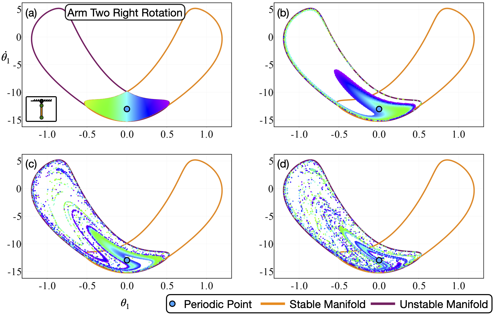

# This folder contains file that illustrates how the special 2Pi periodic orbits that lives inside the intersection of stable and unstable manifold looks like.

The following figure illustrates what will happen if we flow the unstable tube of Down-Up saddle repeatedly. If we flow the unstable manifold for infinitely many times, there will appear a special periodic orbit that always stays inside the intersection of stable and unstable manifold of Down-Up saddle. This point is indicated using a blue dot. This point represents the intersection of a special 2 Pi periodic trajectory with the Poincare plane. This special 2 Pi periodic orbit's motion is illustrated in file "EDoublePendulum_PO2_DownUp_2Pi_Animate.mp4", and it represnt the continuous one-sided full rotation of the second pendulum arm.

