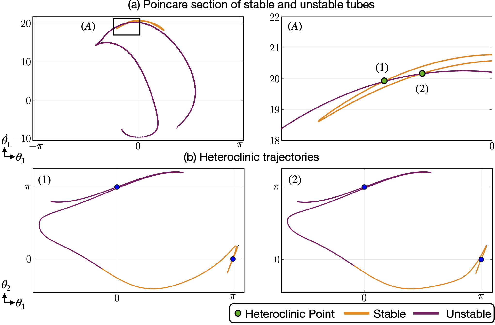

# This folder contains files that illustrate the Heteroclinic motion of the double pendulum.

When the enegy level of the double pendulum is H=0.2, the stable and unstable manifold of the Down-Up and Up-Down UPO can intersect with each other at theta1=theta2 Poincare plane as the following figure shows. The resulting intersection points are the cut points of heteroclinic orbits with the Poincare plane. Those heteroclinic orbits starts from the Down-Up unstable periodic orbit and ends at Up-Down unstable periodic orbits. The file "EDoublePendulum_HeteroclinicTrajectories_X.mp4", where X ranges from 1 to 2 shows how those heteroclinic orbits looks like in the physical space.

