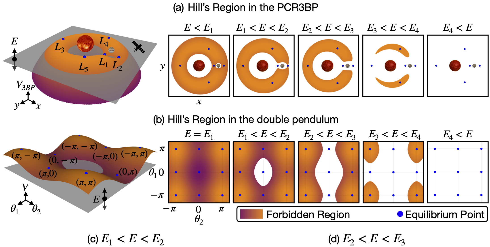

# This repository contains the file needed for paper *"[Saddle Transport and Chaos in the Double Pendulum]()"* by Kaheman and Bramburger et al.

Pendulums are simple mechanical systems that have been studied for centuries and showcase almost every aspect of modern dynamical systems theory. In particular, the double pendulum is a prototypical example of a chaotic system that is easily visualized and so is used to convey the most basic characteristics of complex dynamics. However, little reseach has been done on studying its global pathways, termed tubes, that enable macroscopic transport over vast regions of phase space. Motivated in part by similar studies on the three body problem, we are able to draw a direct comparison between the dynamics of the double pendulum and interstellar transport which exist on vastly different scales. We demonstrate that the double pendulum is a perfect analog system of the three-body problem, as following two figures show. Thus, the double pendulum comes as an excellent table-top testing ground for space mission design that seeks to exploit the gravitationally determined pathways known to exist in multi-body systems. The results of this manuscript detail is a variety of acrobatic motions for the double pendulum in physical space that can be identified and controlled to entrain its motion. For more details, pelase check out our paper *"[Saddle Transport and Chaos in the Double Pendulum]()"*.

 Despite representing dynamics on vastly different scales, the planar restricted 3-body problem (PCR3BP) and the double pendulum bear a striking resemblance. The Lagrange points L1 and L2 in the PCR3BP are analogous to the saddle Down-Up and Up-Down states since they all have one-dimensional stable and unstable directions and a two-dimensional center direction. 

 Hill’s region comparison of PCR3BP and double pendulum. The energy values Ei are meant to denote the transitions in which the Hill’s region is extended to include another critical point of the energy surface. 

