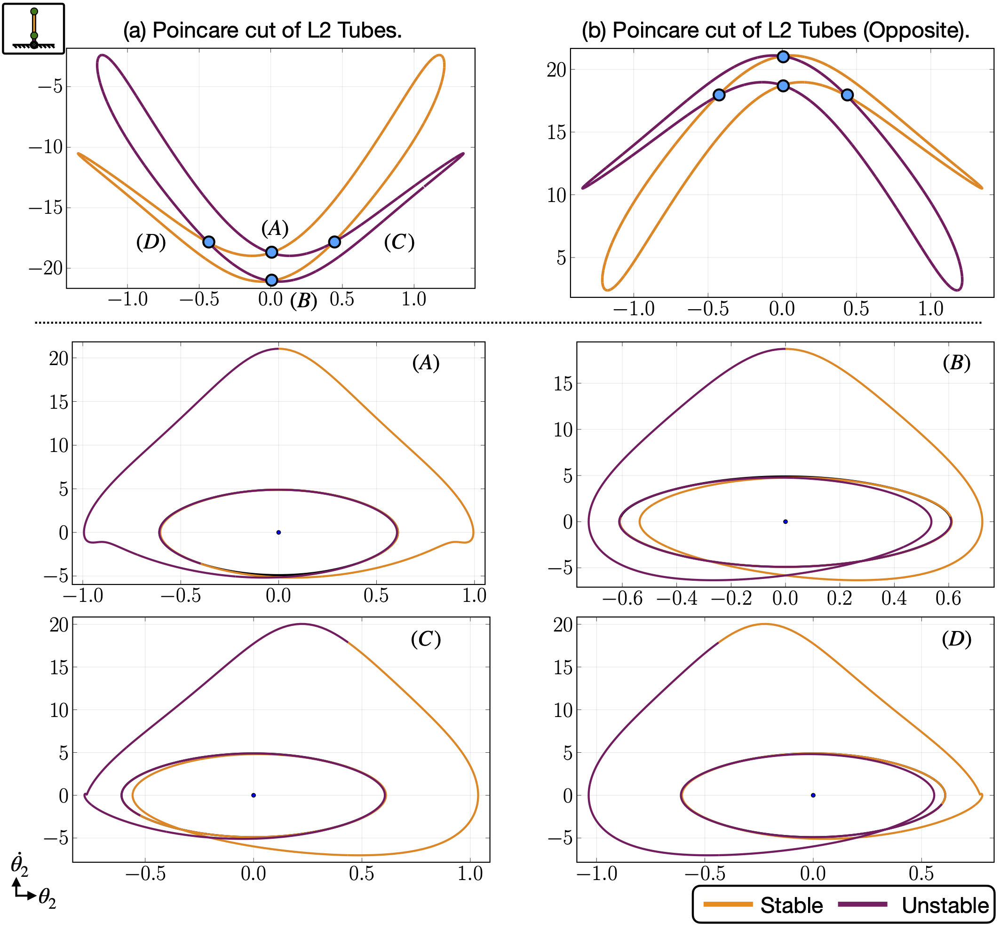

# This folder demonstrates the L2 homoclinic orbits of the double pendulum at energy level H=0.2.

The overview of the intersections of the L2 stable and unstable tubes can be seen in the following figure:

In the above figure, the intersection points (A) to (D) represents the 4 different homoclinic orbits the double pendulum have at the energy level H=0.2. The overview motion of those homoclinic orbits can be seen in "EDP_L2_Homo_Eng_0.2_Index_X.mp4" files, where X ranges from (A) to (D), and corresponds to the intersection points (A) to (D) in the above figure.
